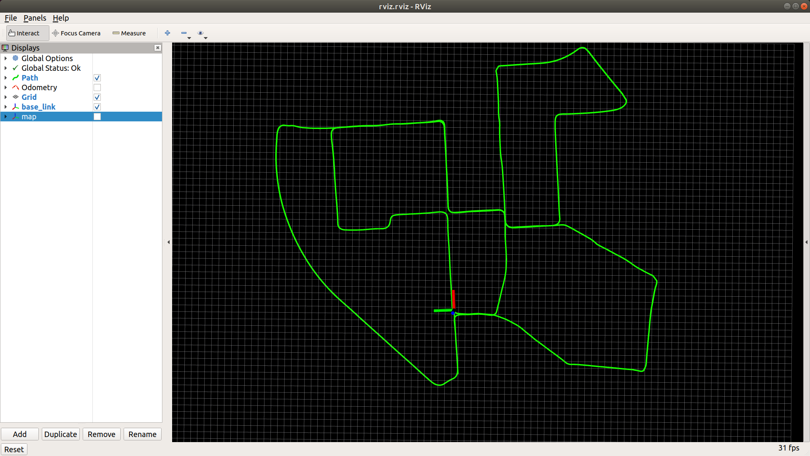

## Readme

A simple KITTI odometry pose visualization package in ROS.

## Compile

```
cd ~/catkin_ws/src
git clone https://github.com/TixiaoShan/kitti_ros.git
cd ..
catkin_make
```

## Parameter

The kitti sequence parameter ```kitti_sequence``` can be changed in ```run.launch```.

## Run

```
roslaunch kitti_ros run.launch
```

<p align='center'>
    
</p>